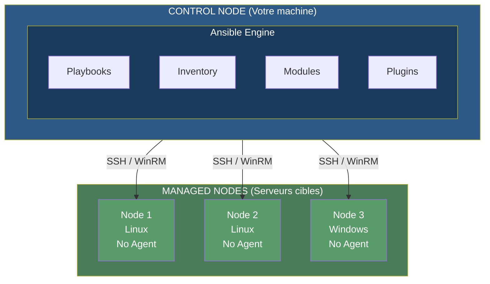
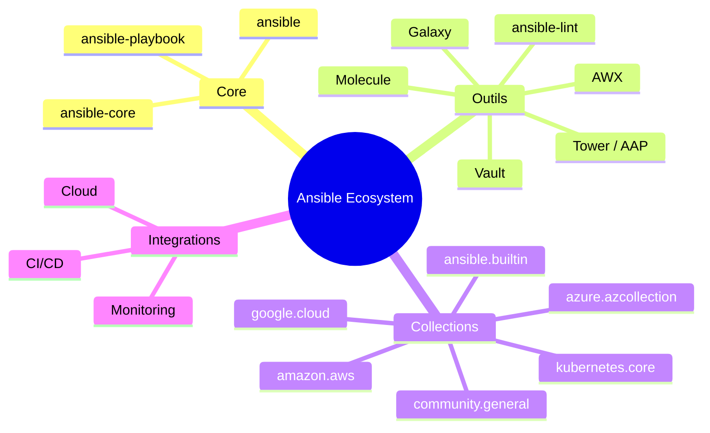

# Installation et configuration d'Ansible

> Jour 1 - Matin (~3h30)

## Table des matieres

1. [Presentation d'Ansible et de ses fonctionnalites](#presentation-dansible-et-de-ses-fonctionnalites)
2. [Prerequis pour l'installation](#prerequis-pour-linstallation)
3. [Installation d'Ansible ou Red Hat Ansible Engine](#installation-dansible-ou-red-hat-ansible-engine)
4. [TP : Installer Ansible et configurer les parametres de base](#tp--installer-ansible-sur-une-machine-linux-et-configurer-les-parametres-de-base)

---

## Presentation d'Ansible et de ses fonctionnalites

### Qu'est-ce qu'Ansible ?

**Ansible** est un outil open-source d'automatisation IT qui permet de gerer la configuration, deployer des applications et orchestrer des taches complexes sur des infrastructures distribuees. Cree en 2012 par Michael DeHaan (ancien contributeur de Puppet et Cobbler), il a ete rachete par Red Hat en 2015, puis integre a l'ecosysteme IBM lors du rachat de Red Hat en 2019.

Ansible se distingue par sa simplicite : les instructions sont ecrites en YAML, un format lisible par un humain sans competences en programmation.

### Architecture agentless (sans agent)

L'un des atouts majeurs d'Ansible est son architecture **agentless** : aucun logiciel supplementaire n'a besoin d'etre installe sur les machines cibles.



**Fonctionnement concret :**

1. Ansible lit le playbook sur le control node
2. Il genere un script Python temporaire
3. Il copie ce script via SSH sur le managed node
4. Il execute le script Python sur le managed node
5. Il recupere le resultat
6. Il supprime le script temporaire

**Avantages de l'approche agentless :**

- Pas de daemon a maintenir sur les serveurs cibles
- Pas de probleme de compatibilite de version d'agent
- Pas de port supplementaire a ouvrir (SSH est deja present)
- Securite renforcee : utilisation du protocole SSH natif

### Idempotence

L'**idempotence** est un concept fondamental dans Ansible : l'execution repetee d'une meme tache produit toujours le meme resultat, sans effet de bord.

```yaml
# Premier run : Apache n'est pas installe
- name: S'assurer qu'Apache est installe
  apt:
    name: apache2
    state: present
# Resultat : Apache est installe (changed=true)

# Deuxieme run : Apache est deja installe
- name: S'assurer qu'Apache est installe
  apt:
    name: apache2
    state: present
# Resultat : Rien a faire (changed=false, ok=true)
```

Ansible detecte automatiquement l'etat actuel du systeme et n'applique que les changements necessaires. Cela garantit qu'on peut executer un playbook autant de fois que souhaite sans risque de casser la configuration.

**Attention aux modules non-idempotents :**

```yaml
# A EVITER : command/shell ne sont pas idempotents par defaut
- name: Installer un package
  command: apt-get install apache2

# BONNE PRATIQUE : utiliser le module dedie
- name: Installer un package
  apt:
    name: apache2
    state: present
```

### Comparaison avec les autres outils

| Critere | Ansible | Puppet | Chef | SaltStack | Terraform |
|---------|---------|--------|------|-----------|-----------|
| **Architecture** | Agentless (SSH) | Agent-based | Agent-based | Agent-based | Agentless (API) |
| **Langage** | YAML | DSL proprietaire | Ruby | YAML/Python | HCL |
| **Courbe d'apprentissage** | Facile | Difficile | Difficile | Moyenne | Facile |
| **Idempotence** | Oui | Oui | Oui | Oui | Oui |
| **Modele** | Push | Pull | Pull | Push et Pull | Push |
| **Cas d'usage principal** | Config Management | Config Management | Config Management | Config + Event-driven | Provisioning |
| **Support Windows** | Oui (WinRM) | Oui | Limite | Oui | Non (API cloud) |

**Comparaison syntaxique :**

```yaml
# Ansible (YAML)
- name: Install nginx
  apt:
    name: nginx
    state: present
```

```puppet
# Puppet (DSL proprietaire)
package { 'nginx':
  ensure => installed,
}
```

```ruby
# Chef (Ruby)
package 'nginx' do
  action :install
end
```

**Quand choisir Ansible ?**

- Configuration management et deploiement d'applications
- Orchestration de workflows multi-etapes
- Environnements mixtes (cloud + on-premise)
- Equipes sans background developpement avance
- Besoin d'un outil rapidement operationnel

**Quand choisir un autre outil ?**

- **Puppet/Chef** : infrastructure a des milliers de serveurs avec besoin d'auto-remediation (pull model)
- **SaltStack** : automatisation event-driven, besoin de performance extreme
- **Terraform** : provisioning d'infrastructure cloud (AWS, Azure, GCP) -- a noter que Terraform et Ansible sont souvent utilises ensemble

**Meilleure pratique : combiner Terraform et Ansible**

```
1. Terraform  -->  Creer l'infrastructure (VMs, reseau, cloud)
2. Ansible    -->  Configurer les systemes (packages, apps, config)
```

### Cas d'usage typiques

- **Configuration management** : maintenir une configuration coherente sur des centaines de serveurs
- **Deploiement d'applications** : deployer sur plusieurs environnements (dev, staging, prod)
- **Provisioning d'infrastructure** : creer et configurer des VMs dans le cloud
- **Orchestration complexe** : rolling updates avec load balancer
- **Securite et compliance** : appliquer des politiques de securite sur tous les serveurs
- **Automatisation reseau** : configurer des equipements Cisco, Juniper, Arista

### Ecosysteme Ansible



| Fonctionnalite | Ansible CLI | AWX | Ansible Tower / AAP |
|----------------|-------------|-----|---------------------|
| **Interface** | Ligne de commande | Web UI | Web UI |
| **RBAC** | Non | Oui | Oui |
| **Planification** | Via cron | Oui | Oui |
| **API REST** | Non | Oui | Oui |
| **Historique des jobs** | Non | Oui | Oui |
| **Support** | Communaute | Communaute | Red Hat |
| **Prix** | Gratuit | Gratuit | Payant |

---

## Prerequis pour l'installation

### Control Node (machine ou Ansible est installe)

**Systemes d'exploitation supportes :**

- Linux (Ubuntu, Debian, RHEL, CentOS, Fedora)
- macOS
- Windows via WSL2 (Windows Subsystem for Linux)

**Remarque importante :** Windows ne peut PAS etre un control node directement. Il faut utiliser WSL2 ou une VM Linux.

**Dependances systeme :**

```bash
# Python 3.8 ou superieur (obligatoire)
python3 --version

# pip (gestionnaire de packages Python)
pip3 --version

# Client SSH (generalement deja installe)
ssh -V
```

### Managed Nodes (serveurs cibles)

Les managed nodes ont des exigences minimales :

- **Acces SSH** (Linux/Unix) ou **WinRM** (Windows)
- **Python 2.7 ou Python 3.5+** (pour la plupart des modules)
- Un utilisateur avec privileges sudo (pour les taches avec `become`)

**Verification sur un managed node :**

```bash
# Se connecter au managed node
ssh user@managed-node

# Verifier la version de Python
python3 --version
# ou
python --version
```

### Recapitulatif des prerequis

| Composant | Control Node | Managed Node |
|-----------|-------------|--------------|
| **OS** | Linux, macOS, WSL2 | Linux, Windows, BSD |
| **Python** | 3.8+ | 2.7+ ou 3.5+ |
| **SSH** | Client SSH | Serveur SSH |
| **Agent Ansible** | Installe | Non necessaire |
| **Reseau** | Acces SSH vers les nodes | Port 22 ouvert |

---

## Installation d'Ansible ou Red Hat Ansible Engine

### Ansible communautaire vs Red Hat Ansible Engine

Il existe deux distributions d'Ansible :

- **Ansible communautaire** (`ansible` / `ansible-core`) : gratuit, open-source, maintenu par la communaute et Red Hat. C'est la version que nous allons installer.
- **Red Hat Ansible Automation Platform (AAP)** : version commerciale incluant Ansible Engine, Ansible Tower (renomme Automation Controller), support Red Hat, certifications de contenu. Destinee aux entreprises avec des besoins de support et de compliance.

Pour la formation, nous utilisons la version communautaire.

### Methode 1 : pip (recommandee)

C'est la methode recommandee car elle fournit la version la plus recente et fonctionne sur toutes les plateformes.

```bash
# Mettre a jour pip
python3 -m pip install --upgrade pip

# Installer Ansible (version complete avec collections)
pip3 install ansible

# OU installer une version specifique
pip3 install ansible==2.16.0

# Verifier l'installation
ansible --version
```

**Installation dans un environnement virtuel (recommande pour l'isolation) :**

```bash
# Creer un environnement virtuel
python3 -m venv ansible-env

# Activer l'environnement virtuel
source ansible-env/bin/activate    # Linux/macOS

# Installer Ansible
pip install ansible

# Verifier l'installation
ansible --version
```

**Sortie attendue :**

```
ansible [core 2.16.0]
  config file = None
  configured module search path = ['/home/user/.ansible/plugins/modules', ...]
  ansible python module location = /usr/local/lib/python3.10/site-packages/ansible
  ansible collection location = /home/user/.ansible/collections
  executable location = /usr/local/bin/ansible
  python version = 3.10.12
```

### Methode 2 : apt (Ubuntu/Debian)

```bash
# Ajouter le PPA Ansible (pour obtenir une version recente)
sudo apt update
sudo apt install software-properties-common
sudo add-apt-repository --yes --update ppa:ansible/ansible

# Installer Ansible
sudo apt update
sudo apt install ansible

# Verifier
ansible --version
```

**Inconvenient :** la version disponible via apt est souvent plus ancienne que celle disponible via pip.

### Methode 3 : yum/dnf (RHEL/CentOS)

```bash
# RHEL/CentOS 8+
sudo dnf install ansible

# RHEL/CentOS 7
sudo yum install epel-release
sudo yum install ansible

# Verifier
ansible --version
```

### Methode 4 : brew (macOS)

```bash
# Installation via Homebrew
brew install ansible

# Verifier
ansible --version
```

### Methode 5 : Docker (pour les tests)

```bash
# Telecharger l'image
docker pull cytopia/ansible:latest

# Executer un playbook
docker run -it --rm \
  -v $(pwd):/ansible \
  -v ~/.ssh:/root/.ssh:ro \
  cytopia/ansible:latest \
  ansible-playbook playbook.yml

# Mode interactif
docker run -it --rm \
  -v $(pwd):/ansible \
  cytopia/ansible:latest \
  /bin/bash
```

### Comparaison des methodes d'installation

| Methode | Version | Facilite | Isolation | Recommande pour |
|---------|---------|----------|-----------|-----------------|
| **pip** | Derniere | Moyenne | Bonne (virtualenv) | Production, Dev |
| **apt/yum** | Plus ancienne | Tres facile | Faible | Serveurs stables |
| **brew** | Recente | Tres facile | Faible | macOS |
| **Docker** | Derniere | Moyenne | Excellente | Tests, CI/CD |

### Configuration de base : ansible.cfg

Le fichier `ansible.cfg` controle le comportement d'Ansible. Il est cherche dans cet ordre de priorite :

1. Variable d'environnement `ANSIBLE_CONFIG`
2. `./ansible.cfg` (repertoire courant)
3. `~/.ansible.cfg` (repertoire personnel)
4. `/etc/ansible/ansible.cfg` (configuration globale)

**Recommandation :** placer `ansible.cfg` a la racine de chaque projet Ansible.

**Configuration minimale :**

```ini
# ansible.cfg
[defaults]
# Chemin vers l'inventaire par defaut
inventory = ./inventory

# Desactiver la verification des cles SSH (pour dev/test uniquement)
host_key_checking = False

# Nombre de connexions paralleles
forks = 5

# Timeout SSH en secondes
timeout = 10

# Utilisateur SSH par defaut
remote_user = ubuntu

# Chemin vers les roles
roles_path = ./roles

[privilege_escalation]
# Utiliser sudo par defaut
become = True
become_method = sudo
become_user = root
become_ask_pass = False

[ssh_connection]
# Pipelining pour ameliorer les performances
pipelining = True
# Reutilisation des connexions SSH
ssh_args = -o ControlMaster=auto -o ControlPersist=60s
```

**Variables d'environnement utiles :**

```bash
# Desactiver l'affichage ASCII art (cowsay)
export ANSIBLE_NOCOWS=1

# Forcer les couleurs dans la sortie
export ANSIBLE_FORCE_COLOR=true

# Desactiver la verification des cles SSH
export ANSIBLE_HOST_KEY_CHECKING=False
```

---

## TP : Installer Ansible sur une machine Linux et configurer les parametres de base

### Objectifs

A l'issue de ce TP, vous serez capable de :

- Installer Ansible sur une machine Linux (ou macOS)
- Verifier que l'installation est fonctionnelle
- Creer et configurer un fichier `ansible.cfg`
- Generer et configurer des cles SSH pour l'authentification
- Tester la connectivite avec un ping Ansible sur localhost

### Prerequis

- Une machine sous Linux (Ubuntu/Debian de preference) ou macOS
- Python 3.8+ installe
- Acces administrateur (sudo)

### Etape 1 : Verifier les dependances systeme

Avant d'installer Ansible, verifiez que les dependances sont presentes.

```bash
# Verifier la version de Python
python3 --version
# Attendu : Python 3.8 ou superieur

# Verifier pip
pip3 --version
# Si absent, installer pip :
# sudo apt install python3-pip   (Debian/Ubuntu)
# sudo dnf install python3-pip   (RHEL/CentOS)

# Verifier SSH
ssh -V
# Attendu : OpenSSH_X.X
```

### Etape 2 : Installer Ansible

**Option A : Installation via pip dans un virtualenv (recommandee)**

```bash
# Creer un repertoire de travail
mkdir -p ~/ansible-workspace
cd ~/ansible-workspace

# Creer un environnement virtuel
python3 -m venv venv

# Activer l'environnement virtuel
source venv/bin/activate

# Installer Ansible
pip install ansible

# Verifier l'installation
ansible --version
```

**Option B : Installation via le gestionnaire de paquets**

```bash
# Ubuntu/Debian
sudo apt update
sudo apt install software-properties-common
sudo add-apt-repository --yes --update ppa:ansible/ansible
sudo apt install ansible

# RHEL/CentOS 8+
sudo dnf install ansible

# macOS
brew install ansible
```

### Etape 3 : Verifier l'installation

Executez les commandes suivantes pour confirmer que tout fonctionne :

```bash
# Version d'Ansible
ansible --version

# Liste des modules disponibles
ansible-doc -l | head -20

# Aide sur un module specifique
ansible-doc ping

# Afficher la configuration active
ansible-config dump --only-changed
```

### Etape 4 : Creer la structure du projet et le fichier ansible.cfg

```bash
# Creer la structure du projet
mkdir -p ~/ansible-workspace/{inventory,roles,playbooks}

# Creer le fichier de configuration
cat > ~/ansible-workspace/ansible.cfg << 'EOF'
[defaults]
inventory = ./inventory/hosts
host_key_checking = False
forks = 5
timeout = 10
remote_user = ubuntu
roles_path = ./roles
retry_files_enabled = False
stdout_callback = yaml

[privilege_escalation]
become = True
become_method = sudo
become_user = root
become_ask_pass = False

[ssh_connection]
pipelining = True
ssh_args = -o ControlMaster=auto -o ControlPersist=60s
EOF
```

Verifiez que la configuration est bien prise en compte :

```bash
cd ~/ansible-workspace
ansible-config dump --only-changed
```

Vous devriez voir les parametres que vous venez de definir.

### Etape 5 : Generer et configurer les cles SSH

```bash
# Generer une paire de cles SSH dediee a Ansible
ssh-keygen -t ed25519 -C "ansible-automation" -f ~/.ssh/ansible_key -N ""

# Verifier que les fichiers ont ete crees
ls -la ~/.ssh/ansible_key*

# Verifier les permissions (important pour la securite)
# ansible_key doit etre en 600, ansible_key.pub en 644
chmod 600 ~/.ssh/ansible_key
chmod 644 ~/.ssh/ansible_key.pub
```

Pour un test local (localhost), ajoutez la cle publique aux cles autorisees de votre propre machine :

```bash
# Ajouter la cle publique a authorized_keys
cat ~/.ssh/ansible_key.pub >> ~/.ssh/authorized_keys

# Verifier les permissions de authorized_keys
chmod 600 ~/.ssh/authorized_keys

# Tester la connexion SSH en local
ssh -i ~/.ssh/ansible_key localhost "echo 'Connexion SSH reussie'"
```

### Etape 6 : Creer l'inventaire et tester avec localhost

```bash
# Creer le fichier d'inventaire
cat > ~/ansible-workspace/inventory/hosts << 'EOF'
[local]
localhost ansible_connection=local

[local:vars]
ansible_python_interpreter=/usr/bin/python3
EOF
```

Executez le premier test de connectivite :

```bash
cd ~/ansible-workspace

# Test avec une commande ad-hoc : ping
ansible localhost -m ping

# Sortie attendue :
# localhost | SUCCESS => {
#     "changed": false,
#     "ping": "pong"
# }
```

Testez quelques commandes supplementaires :

```bash
# Recuperer des informations systeme
ansible localhost -m setup -a "filter=ansible_distribution*"

# Executer une commande shell
ansible localhost -m shell -a "uptime"

# Verifier l'espace disque
ansible localhost -m shell -a "df -h"
```

### Etape 7 : Creer et executer un premier playbook de verification

Creez le fichier `~/ansible-workspace/playbooks/verification.yml` :

```yaml
---
# playbooks/verification.yml
# Playbook de verification de l'installation Ansible
- name: Verification de l'installation Ansible
  hosts: localhost
  gather_facts: yes
  tasks:
    - name: Test de connectivite (ping)
      ping:

    - name: Afficher les informations systeme
      debug:
        msg: |
          Hostname     : {{ ansible_hostname }}
          OS           : {{ ansible_distribution }} {{ ansible_distribution_version }}
          Architecture : {{ ansible_architecture }}
          Python       : {{ ansible_python_version }}
          Noyau        : {{ ansible_kernel }}

    - name: Verifier que Python 3 est disponible
      command: python3 --version
      register: python_version
      changed_when: false

    - name: Afficher la version de Python
      debug:
        msg: "Python detecte : {{ python_version.stdout }}"

    - name: Creer un fichier de test
      copy:
        content: "Installation Ansible verifiee avec succes.\n"
        dest: /tmp/ansible_test.txt
        mode: '0644'

    - name: Lire le fichier de test
      command: cat /tmp/ansible_test.txt
      register: fichier_test
      changed_when: false

    - name: Confirmer le contenu du fichier
      debug:
        msg: "{{ fichier_test.stdout }}"

    - name: Nettoyer le fichier de test
      file:
        path: /tmp/ansible_test.txt
        state: absent
```

Executez le playbook :

```bash
cd ~/ansible-workspace
ansible-playbook playbooks/verification.yml
```

**Sortie attendue :**

```
PLAY [Verification de l'installation Ansible] *********************************

TASK [Gathering Facts] ********************************************************
ok: [localhost]

TASK [Test de connectivite (ping)] ********************************************
ok: [localhost]

TASK [Afficher les informations systeme] **************************************
ok: [localhost] => {
    "msg": "Hostname     : ma-machine\nOS           : Ubuntu 22.04\n..."
}

...

PLAY RECAP ********************************************************************
localhost                  : ok=8    changed=1    unreachable=0    failed=0
```

### Livrables attendus

A la fin de ce TP, vous devez fournir :

1. **Capture d'ecran** de la sortie de `ansible --version` montrant l'installation fonctionnelle
2. **Le fichier `ansible.cfg`** configure dans votre repertoire de travail
3. **Le fichier d'inventaire** `inventory/hosts` avec au minimum localhost
4. **Capture d'ecran** de la sortie du `ansible localhost -m ping` reussi (pong)
5. **Capture d'ecran** de l'execution reussie du playbook `verification.yml`

### Criteres de validation

| Critere | Description | Valide |
|---------|-------------|--------|
| Installation | Ansible est installe et `ansible --version` retourne une version valide | |
| Configuration | Le fichier `ansible.cfg` est present et contient les parametres de base (inventory, forks, remote_user) | |
| Cles SSH | Une paire de cles SSH dediee a Ansible a ete generee avec les bonnes permissions (600/644) | |
| Inventaire | Un fichier d'inventaire est cree avec au minimum une entree localhost | |
| Ping | La commande `ansible localhost -m ping` retourne SUCCESS avec "pong" | |
| Playbook | Le playbook `verification.yml` s'execute sans erreur et affiche les informations systeme | |
| Structure | Le repertoire de travail respecte l'arborescence demandee (inventory/, roles/, playbooks/) | |

---

## Ressources complementaires

- [Documentation officielle Ansible](https://docs.ansible.com/)
- [Guide d'installation Ansible](https://docs.ansible.com/ansible/latest/installation_guide/index.html)
- [Configuration Ansible (ansible.cfg)](https://docs.ansible.com/ansible/latest/reference_appendices/config.html)
- [Ansible for DevOps](https://www.ansiblefordevops.com/) -- Jeff Geerling
- [Ansible 101 (video)](https://www.youtube.com/watch?v=goclfp6a2IQ&list=PL2_OBreMn7FqZkvMYt6ATmgC0KAGGJNAN) -- Jeff Geerling
