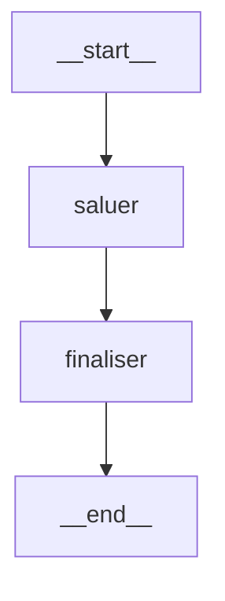

# LangGraph — Introduction

## Objectifs

- Comprendre pourquoi LangGraph existe et ce qu'il apporte par rapport à LangChain
- Saisir la différence entre une chaîne (chain) et un graphe
- Identifier les composants fondamentaux : StateGraph, nœuds, arêtes, état
- Exécuter un premier graphe minimal

---

## Contexte : de LangChain à LangGraph

LangChain a popularisé la composition de LLMs via des **chaînes** (chains) :

```python
# LangChain classique — pipeline linéaire
from langchain_core.prompts import ChatPromptTemplate
from langchain_openai import ChatOpenAI

prompt = ChatPromptTemplate.from_template("Résume ce texte : {text}")
llm = ChatOpenAI(model="gpt-4o-mini")

chain = prompt | llm
result = chain.invoke({"text": "..."})
```

Les chaînes sont parfaites pour les pipelines **linéaires**. Mais elles ne permettent pas de :

- **Boucler** (retourner en arrière selon une condition)
- **Décider** dynamiquement quelle branche emprunter
- **Conserver un état** mutable partagé entre les étapes
- **Interrompre** l'exécution pour demander une validation humaine

LangGraph répond à ces limitations en modélisant le flux comme un **graphe orienté**.

---

## Le modèle mental : un graphe d'état

Imaginez un automate à états finis, mais où chaque transition est pilotée par un LLM ou une logique Python.

```
        ┌─────────────┐
  START │             │
   ──►  │   raisonner │ ◄───────────┐
        │             │             │
        └──────┬──────┘             │
               │                    │
               ▼                    │
        ┌─────────────┐    OUI      │
        │   décider   │─────────────┘
        │             │
        └──────┬──────┘
               │ NON
               ▼
             END
```

Dans LangGraph :
- Chaque **boîte** = un nœud (une fonction Python)
- Chaque **flèche** = une arête (une transition)
- Les flèches conditionnelles = des arêtes conditionnelles
- L'**état** = un dictionnaire qui circule entre les nœuds

---

## Installation

```bash
pip install langgraph langchain-openai python-dotenv
```

Vérifier l'installation :

```python
import langgraph
print(langgraph.__version__)  # 0.2.x ou supérieur
```

---

## Premier graphe : hello world

Voici le graphe le plus simple possible — deux nœuds en séquence :

```python
# hello_graph.py
from typing import TypedDict
from langgraph.graph import StateGraph, END

# 1. Définir l'état partagé
class EtatSimple(TypedDict):
    message: str
    resultat: str

# 2. Définir les nœuds (fonctions Python)
def noeud_saluer(etat: EtatSimple) -> dict:
    """Premier nœud : prépare un message de bienvenue."""
    print(f"[noeud_saluer] Message reçu : {etat['message']}")
    return {"resultat": f"Bonjour ! Vous avez dit : {etat['message']}"}

def noeud_finaliser(etat: EtatSimple) -> dict:
    """Deuxième nœud : finalise la réponse."""
    print(f"[noeud_finaliser] Résultat : {etat['resultat']}")
    return {"resultat": etat["resultat"] + " — Traitement terminé."}

# 3. Construire le graphe
constructeur = StateGraph(EtatSimple)

# Ajouter les nœuds
constructeur.add_node("saluer", noeud_saluer)
constructeur.add_node("finaliser", noeud_finaliser)

# Définir le nœud de départ
constructeur.set_entry_point("saluer")

# Ajouter les arêtes
constructeur.add_edge("saluer", "finaliser")
constructeur.add_edge("finaliser", END)

# 4. Compiler le graphe
graphe = constructeur.compile()

# 5. Exécuter
etat_initial = {"message": "LangGraph est puissant", "resultat": ""}
etat_final = graphe.invoke(etat_initial)

print("\nÉtat final :", etat_final)
```

Résultat attendu :

```
[noeud_saluer] Message reçu : LangGraph est puissant
[noeud_finaliser] Résultat : Bonjour ! Vous avez dit : LangGraph est puissant
État final : {
  'message': 'LangGraph est puissant',
  'resultat': 'Bonjour ! Vous avez dit : LangGraph est puissant — Traitement terminé.'
}
```

---

> 🔴 **ACTION FORMATEUR — CAPTURE REQUISE**
> **Capturer :** L'exécution du script `hello_graph.py` dans le terminal, montrant les prints de chaque nœud s'affichant séquentiellement.
> **Expliquer :** Insister sur le fait que chaque nœud reçoit l'état complet en entrée et retourne uniquement les clés qu'il modifie. LangGraph fusionne automatiquement le retour partiel dans l'état global.

---

## Visualiser le graphe

LangGraph peut générer une représentation Mermaid du graphe :

```python
# Visualisation en ASCII
print(graphe.get_graph().draw_ascii())

# Visualisation Mermaid (pour Jupyter ou export)
print(graphe.get_graph().draw_mermaid())
```

Résultat ASCII :

```
        +-----------+
        | __start__ |
        +-----------+
               *
               *
               *
         +--------+
         | saluer |
         +--------+
               *
               *
               *
        +-----------+
        | finaliser |
        +-----------+
               *
               *
               *
        +---------+
        | __end__ |
        +---------+
```

Résultat Mermaid :



---

> 🔴 **ACTION FORMATEUR — CAPTURE REQUISE**
> **Capturer :** La sortie `draw_mermaid()` dans Jupyter Notebook avec rendu graphique du diagramme. Utiliser `IPython.display` pour le rendu visuel.
> **Expliquer :** Montrer que ce diagramme correspond exactement au code écrit. La visualisation est un outil de débogage essentiel pour les graphes complexes.

---

## Les composants fondamentaux

### 1. L'état (State)

L'état est le **contrat de données** entre tous les nœuds du graphe. C'est un `TypedDict` Python :

```python
from typing import TypedDict, Annotated
from langgraph.graph.message import add_messages

class EtatAgent(TypedDict):
    # Champ simple — la dernière valeur écrase la précédente
    etape_courante: str

    # Champ avec réducteur — les nouvelles valeurs s'accumulent
    messages: Annotated[list, add_messages]

    # Champ optionnel
    contexte: str | None
```

**Important** : Par défaut, quand un nœud retourne `{"cle": valeur}`, cette valeur **remplace** l'ancienne. Avec le réducteur `add_messages`, les nouveaux messages sont **ajoutés** à la liste existante.

```python
# Sans réducteur — remplacement
def noeud_a(etat):
    return {"etape_courante": "etape_b"}  # Remplace l'ancienne valeur

# Avec réducteur add_messages — accumulation
def noeud_b(etat):
    return {"messages": [AIMessage(content="Réponse")]}  # Ajouté à la liste
```

### 2. Le StateGraph

`StateGraph` est le constructeur du graphe. Il prend le type de l'état en paramètre :

```python
from langgraph.graph import StateGraph

graphe = StateGraph(EtatAgent)
```

### 3. Les nœuds (Nodes)

Un nœud est une **fonction Python** qui :
- Prend l'état complet en entrée
- Retourne un dictionnaire partiel (seulement les clés modifiées)

```python
def mon_noeud(etat: EtatAgent) -> dict:
    # Lire depuis l'état
    messages = etat["messages"]

    # Faire quelque chose (appel LLM, logique, etc.)
    reponse = "..."

    # Retourner uniquement les modifications
    return {"etape_courante": "traitement_fait"}
```

### 4. Les arêtes (Edges)

Trois types d'arêtes :

```python
# Arête directe — toujours traversée
graphe.add_edge("noeud_a", "noeud_b")

# Arête vers END — termine le graphe
graphe.add_edge("dernier_noeud", END)

# Arête conditionnelle — décision dynamique
def ma_condition(etat: EtatAgent) -> str:
    if etat["etape_courante"] == "continuer":
        return "continuer"
    return "terminer"

graphe.add_conditional_edges(
    "noeud_decision",
    ma_condition,
    {
        "continuer": "noeud_suivant",
        "terminer": END
    }
)
```

### 5. Le point d'entrée et de sortie

```python
# Point d'entrée — premier nœud exécuté
graphe.set_entry_point("premier_noeud")

# Équivalent avec add_edge depuis START
from langgraph.graph import START
graphe.add_edge(START, "premier_noeud")
```

---

## Graphe avec LLM : premier exemple réel

Maintenant, intégrons un vrai LLM dans un nœud :

```python
# graph_avec_llm.py
import os
from dotenv import load_dotenv
from typing import TypedDict, Annotated
from langchain_openai import ChatOpenAI
from langchain_core.messages import HumanMessage, AIMessage, BaseMessage
from langgraph.graph import StateGraph, END
from langgraph.graph.message import add_messages

load_dotenv()

# Initialiser le LLM
llm = ChatOpenAI(model="gpt-4o-mini", temperature=0)

# État avec historique de messages
class EtatConversation(TypedDict):
    messages: Annotated[list[BaseMessage], add_messages]

# Nœud LLM
def appeler_llm(etat: EtatConversation) -> dict:
    """Appelle le LLM avec l'historique complet."""
    messages = etat["messages"]
    reponse = llm.invoke(messages)
    return {"messages": [reponse]}

# Construire le graphe
graphe = StateGraph(EtatConversation)
graphe.add_node("llm", appeler_llm)
graphe.set_entry_point("llm")
graphe.add_edge("llm", END)
application = graphe.compile()

# Tester
message_initial = HumanMessage(content="Explique-moi LangGraph en 2 phrases.")
resultat = application.invoke({"messages": [message_initial]})

# Afficher la dernière réponse
derniere_reponse = resultat["messages"][-1]
print(f"LLM : {derniere_reponse.content}")
```

---

> 🔴 **ACTION FORMATEUR — CAPTURE REQUISE**
> **Capturer :** L'exécution du script `graph_avec_llm.py` en montrant la variable d'environnement `OPENAI_API_KEY` masquée (ne pas afficher la clé) puis la réponse du LLM qui s'affiche.
> **Expliquer :** Souligner que même avec un seul nœud LLM, LangGraph apporte une structure : l'état est clairement défini, le graphe est visualisable, et il sera facile d'ajouter des nœuds supplémentaires ensuite.

---

## Différences avec LangChain LCEL

| Aspect | LangChain LCEL | LangGraph |
|--------|---------------|-----------|
| Structure | Pipeline linéaire `|` | Graphe orienté |
| État | Implicite (passage de valeur) | Explicite (TypedDict) |
| Boucles | Non | Oui |
| Branchements | Limité (RunnableBranch) | Natif |
| Human-in-the-loop | Non | Natif |
| Débogage | Callbacks | LangSmith + visualisation |

LangGraph n'**remplace** pas LangChain — il le **complète**. Les nœuds LangGraph utilisent souvent des chaînes LCEL en interne.

---

## Points clés à retenir

1. Un graphe LangGraph = **nœuds** (fonctions) + **arêtes** (transitions) + **état** (TypedDict)
2. Chaque nœud **reçoit l'état complet** et **retourne un dict partiel** (les modifications)
3. LangGraph **fusionne** les modifications dans l'état global automatiquement
4. Le réducteur `add_messages` permet d'**accumuler** des messages au lieu de les remplacer
5. `compile()` transforme le constructeur en graphe **exécutable**
6. Visualiser avec `draw_mermaid()` ou `draw_ascii()` pour comprendre le flux

---

## Exercice rapide

Modifiez le graphe `graph_avec_llm.py` pour ajouter un nœud de **validation** entre le LLM et END :

- Ce nœud vérifie que la réponse fait moins de 500 caractères
- Si elle est trop longue, il retourne `{"trop_long": True}`
- L'état doit contenir un champ `trop_long: bool`

*Solution dans le fichier suivant (`02-state-nodes-edges.md`)*

---

## Suite

Passez à `02-state-nodes-edges.md` pour apprendre à construire des graphes plus complexes avec des arêtes conditionnelles et des boucles.
