# PlantUML et C4-PlantUML

## Qu'est-ce que PlantUML ?

PlantUML est un outil open source qui génère des diagrammes à partir de **descriptions textuelles**. Il supporte UML (classe, séquence, activité, composant...) et de nombreuses extensions dont C4.

**Avantage clé :** Les diagrammes sont du texte — ils peuvent être versionnés dans Git, reviewés dans les PRs, et générés automatiquement en CI/CD.

---

## Installation et environnements

### VSCode (recommandé)

```
Extensions VSCode :
1. PlantUML (jebbs.plantuml) — prévisualisation locale
2. Markdown Preview Enhanced — rendu dans les .md
```

**Configuration VSCode :**
```json
{
  "plantuml.server": "https://www.plantuml.com/plantuml",
  "plantuml.render": "PlantUMLServer"
}
```

Raccourci pour prévisualiser : `Alt+D` (Windows/Linux) ou `Option+D` (macOS)

### Serveur web PlantUML

Tester en ligne sans installation : https://www.plantuml.com/plantuml/uml/

### Via Docker

```bash
docker run -d -p 8080:8080 plantuml/plantuml-server:jetty
```

Puis accéder à `http://localhost:8080` pour le serveur local.

### Dans un CI/CD (GitHub Actions)

```yaml
- name: Generate PlantUML diagrams
  uses: cloudbees/plantuml-github-action@master
  with:
    args: -tpng docs/architecture/*.puml
```

---

## La bibliothèque C4-PlantUML

C4-PlantUML est une bibliothèque qui ajoute les formes et la notation C4 à PlantUML.

### Import

```plantuml
!include https://raw.githubusercontent.com/plantuml-stdlib/C4-PlantUML/master/C4_Context.puml
!include https://raw.githubusercontent.com/plantuml-stdlib/C4-PlantUML/master/C4_Container.puml
!include https://raw.githubusercontent.com/plantuml-stdlib/C4-PlantUML/master/C4_Component.puml
```

**Fichiers disponibles :**
- `C4_Context.puml` → Niveau 1
- `C4_Container.puml` → Niveau 2
- `C4_Component.puml` → Niveau 3
- `C4_Dynamic.puml` → Diagrammes de séquence C4
- `C4_Deployment.puml` → Déploiement

---

## Diagramme de Contexte (Niveau 1)

```plantuml
@startuml DiagrammeContexte

!include https://raw.githubusercontent.com/plantuml-stdlib/C4-PlantUML/master/C4_Context.puml

title Diagramme de Contexte — Plateforme DataFlow

LAYOUT_WITH_LEGEND()

Person(dataAnalyst, "Data Analyst", "Analyse les données de ventes\net crée des rapports.")

Person(directeurCommercial, "Directeur Commercial", "Consulte les KPIs\net les tableaux de bord.")

System(dataflow, "Plateforme DataFlow", "Collecte, transforme et expose\nles données métier de l'entreprise.")

System_Ext(salesforce, "Salesforce CRM", "Gestion de la relation client.\nSource des données commerciales.")

System_Ext(erp, "Système ERP (SAP)", "Gestion des commandes, stocks,\nfacturation.")

System_Ext(emailSystem, "Système Email", "Envoi des rapports automatiques\naux équipes.")

Rel(dataAnalyst, dataflow, "Consulte les dashboards", "HTTPS")
Rel(directeurCommercial, dataflow, "Consulte les KPIs", "HTTPS")
Rel(dataflow, salesforce, "Importe les données clients et ventes", "API REST HTTPS")
Rel(dataflow, erp, "Importe les commandes et le stock", "JDBC / API")
Rel(dataflow, emailSystem, "Envoie les rapports automatiques", "SMTP")

@enduml
```

### Macros disponibles pour le contexte

| Macro | Description |
|-------|-------------|
| `Person(alias, label, description)` | Acteur humain |
| `Person_Ext(alias, label, description)` | Acteur humain externe |
| `System(alias, label, description)` | Système logiciel |
| `System_Ext(alias, label, description)` | Système externe (en gris) |
| `Rel(from, to, label)` | Relation simple |
| `Rel(from, to, label, technology)` | Relation avec technologie |
| `Rel_Back(from, to, label)` | Relation inversée |
| `BiRel(from, to, label)` | Relation bidirectionnelle |

---

## Diagramme de Conteneurs (Niveau 2)

```plantuml
@startuml DiagrammeConteneurs

!include https://raw.githubusercontent.com/plantuml-stdlib/C4-PlantUML/master/C4_Container.puml

title Diagramme de Conteneurs — Plateforme DataFlow

LAYOUT_WITH_LEGEND()

Person(dataAnalyst, "Data Analyst", "")
Person(directeurCommercial, "Directeur Commercial", "")

System_Ext(salesforce, "Salesforce CRM", "Source de données CRM")
System_Ext(erp, "Système ERP", "Source de données ERP")

System_Boundary(c1, "Plateforme DataFlow") {

    Container(metabase, "Metabase", "Application Web, JavaScript", "Interface de visualisation\net création de dashboards.")

    Container(api, "API DataFlow", "Python, FastAPI", "Expose les données et déclenche\nles pipelines via REST.")

    ContainerDb(dwhPostgres, "Data Warehouse", "PostgreSQL 15", "Stocke les données transformées\net agrégées pour l'analyse.")

    Container(airflow, "Apache Airflow", "Python, Airflow 2.7", "Orchestre les pipelines d'ingestion\net de transformation.")

    ContainerDb(dataLake, "Data Lake", "S3 (MinIO local)", "Stockage brut des données sources\navant transformation.")

    Container(dbt, "dbt", "Python, dbt Core", "Transformations SQL et\nmodélisation des données.")
}

Rel(dataAnalyst, metabase, "Consulte", "HTTPS")
Rel(directeurCommercial, metabase, "Consulte les KPIs", "HTTPS")
Rel(metabase, dwhPostgres, "Requête", "SQL / JDBC")

Rel(dataAnalyst, api, "Déclenche des pipelines", "HTTPS / REST")
Rel(api, airflow, "Déclenche les DAGs", "HTTP API")
Rel(api, dwhPostgres, "Lit les données", "SQL")

Rel(airflow, salesforce, "Extrait les données", "API REST HTTPS")
Rel(airflow, erp, "Extrait les données", "JDBC")
Rel(airflow, dataLake, "Stocke les données brutes", "S3 API")
Rel(airflow, dbt, "Exécute les transformations", "CLI")
Rel(dbt, dwhPostgres, "Écrit les données transformées", "SQL")
Rel(airflow, dataLake, "Lit les données brutes", "S3 API")

@enduml
```

### Macros disponibles pour les conteneurs

| Macro | Description |
|-------|-------------|
| `Container(alias, label, technology, description)` | Application, service |
| `ContainerDb(alias, label, technology, description)` | Base de données |
| `ContainerQueue(alias, label, technology, description)` | Queue / broker de messages |
| `Container_Ext(...)` | Conteneur externe |
| `System_Boundary(alias, label) { }` | Groupe les conteneurs d'un système |

---

## Diagramme de Composants (Niveau 3)

```plantuml
@startuml DiagrammeComposants

!include https://raw.githubusercontent.com/plantuml-stdlib/C4-PlantUML/master/C4_Component.puml

title Diagramme de Composants — API DataFlow (FastAPI)

LAYOUT_WITH_LEGEND()

Person(dataAnalyst, "Data Analyst", "")
ContainerDb(dwhPostgres, "Data Warehouse", "PostgreSQL", "")
Container_Ext(airflow, "Apache Airflow", "Python", "")

System_Boundary(apiContainer, "API DataFlow") {

    Component(router, "API Routers", "FastAPI Routers", "Routes HTTP : /pipelines,\n/reports, /alerts, /health")

    Component(authMiddleware, "Auth Middleware", "Python, JWT", "Valide les tokens JWT\net les droits d'accès.")

    Component(pipelineService, "Pipeline Service", "Python", "Logique métier pour\ndéclencher et suivre les pipelines.")

    Component(reportService, "Report Service", "Python", "Génère et expose les\nrapports agrégés.")

    Component(alertService, "Alert Service", "Python", "Gère les seuils d'alerte\net les notifications.")

    Component(pipelineRepo, "Pipeline Repository", "SQLAlchemy", "Accès aux données\ndes pipelines en BDD.")

    Component(reportRepo, "Report Repository", "SQLAlchemy", "Accès aux rapports\net agrégats en BDD.")
}

Rel(dataAnalyst, router, "Appelle l'API", "HTTPS / JSON")
Rel(router, authMiddleware, "Vérifie le token", "")
Rel(router, pipelineService, "Délègue", "")
Rel(router, reportService, "Délègue", "")
Rel(router, alertService, "Délègue", "")
Rel(pipelineService, airflow, "Déclenche les DAGs", "HTTP REST")
Rel(pipelineService, pipelineRepo, "Lit/écrit", "")
Rel(reportService, reportRepo, "Lit", "")
Rel(pipelineRepo, dwhPostgres, "SQL", "JDBC")
Rel(reportRepo, dwhPostgres, "SQL", "JDBC")

@enduml
```

---

## Options de mise en page

```plantuml
' Orientations
LAYOUT_TOP_DOWN()       ' Par défaut
LAYOUT_LEFT_RIGHT()     ' De gauche à droite (utile pour les longs flows)

' Légende automatique
LAYOUT_WITH_LEGEND()

' Taille des éléments
LAYOUT_AS_SKETCH()      ' Style dessin à la main (informal)

' Espacement
skinparam nodesep 50    ' Espacement horizontal
skinparam ranksep 80    ' Espacement vertical
```

---

> 🔴 **ACTION FORMATEUR — CAPTURE REQUISE**
> **Capturer :** VSCode avec l'extension PlantUML ouverte, montrant un fichier `.puml` à gauche et la prévisualisation du diagramme C4 rendu à droite (vue split), puis faire une modification dans le texte et montrer que le diagramme se met à jour en temps réel.
> **Expliquer :** Pourquoi le fait que les diagrammes soient du texte est crucial (versionnage Git, diff dans les PRs, génération CI/CD), et comment modifier un seul mot dans le source suffit à mettre à jour un diagramme complexe — contrairement à un outil de dessin graphique.

---

## Intégration dans la documentation

### Dans les fichiers Markdown (GitHub/GitLab)

GitHub et GitLab supportent PlantUML via des plugins ou des liens encodés.

**Option 1 — Lien vers le serveur PlantUML :**
```markdown

```

**Option 2 — Markdown Preview Enhanced (VSCode) :**
````markdown

```plantuml
@startuml
...
@enduml
```

````

**Option 3 — Génération d'images en CI/CD :**
```yaml
# GitHub Actions
- name: Generate diagrams
  run: |
    docker run --rm -v $(pwd):/data plantuml/plantuml:latest \
      -tpng /data/docs/architecture/*.puml
- name: Commit generated images
  uses: stefanzweifel/git-auto-commit-action@v4
```

---

## Bonnes pratiques PlantUML C4

**Nommer les fichiers de façon explicite :**
```
docs/architecture/
├── c4-01-context.puml
├── c4-02-containers.puml
├── c4-03-components-api.puml
└── c4-03-components-airflow.puml
```

**Utiliser des alias courts mais lisibles :**
```plantuml
' Pas bien
Container(c1, "API", "FastAPI", "...")
' Mieux
Container(api, "API DataFlow", "Python, FastAPI 0.109", "...")
```

**Documenter les technologies de manière cohérente :**
Format recommandé : `Langage, Framework Version` ou `Technologie Version`
```
"Python, FastAPI 0.109"
"PostgreSQL 15.4"
"Apache Airflow 2.7"
```

---

## Résumé

| Concept | Détail |
|---------|--------|
| C4-PlantUML | Bibliothèque qui ajoute la notation C4 à PlantUML |
| Diagramme Context | `C4_Context.puml` — Person, System, System_Ext |
| Diagramme Container | `C4_Container.puml` — Container, ContainerDb, System_Boundary |
| Diagramme Component | `C4_Component.puml` — Component, System_Boundary |
| Avantage principal | Diagrammes-as-code : versionnés, reviewables, auto-générés |
