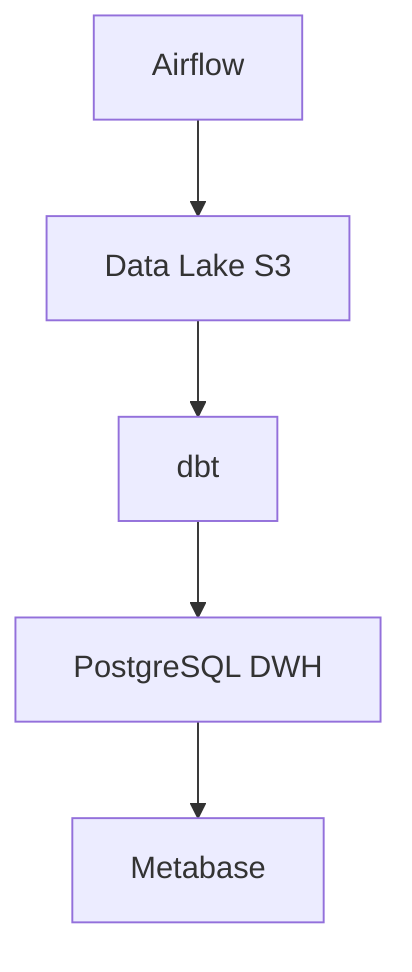
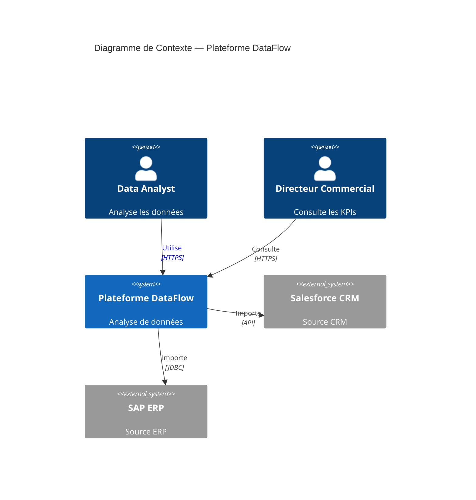
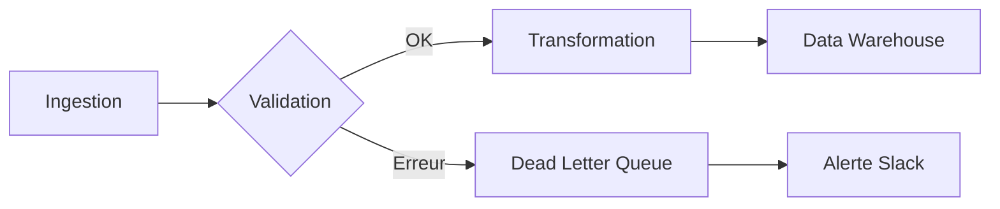
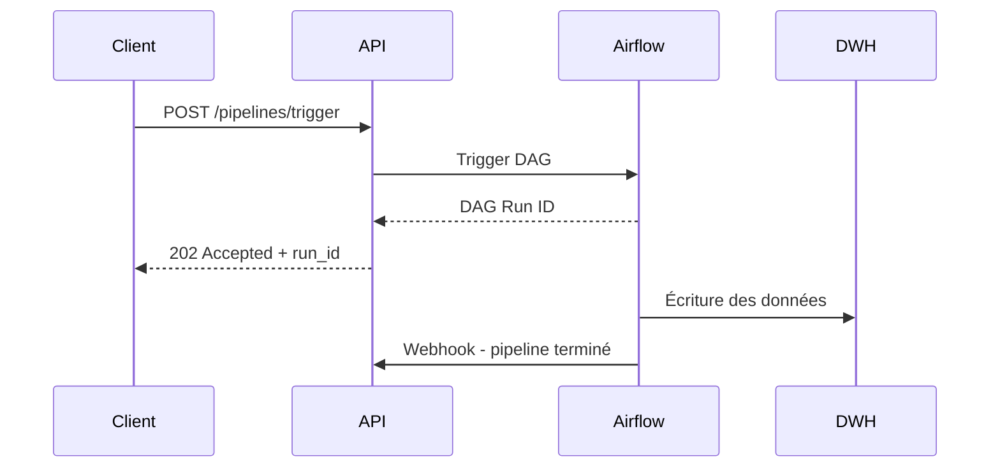
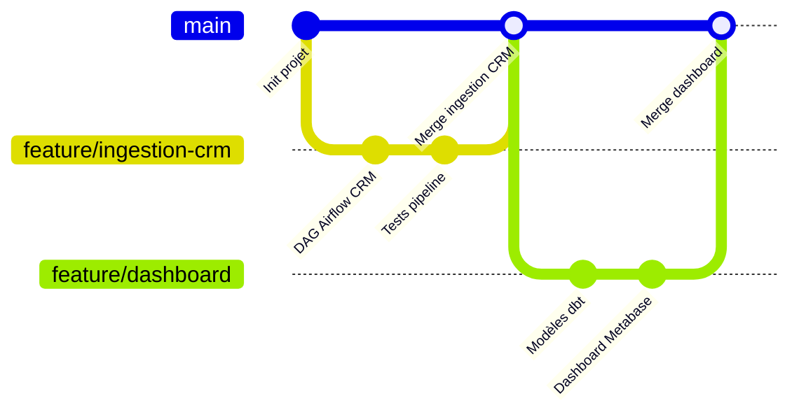

# Autres outils de diagrammes d'architecture

## Vue d'ensemble

Le paysage des outils de diagrammes est vaste. Ce module couvre les alternatives à PlantUML et Structurizr, en distinguant les outils **diagrams-as-code** (texte → diagramme) des outils **graphiques** (dessin interactif).

---

## Mermaid

### Présentation

Mermaid est un outil open source de diagrammes-as-code intégré nativement dans **GitHub, GitLab, Notion et Obsidian**. Sa syntaxe est plus simple que PlantUML mais moins puissante.

**Point fort :** Pas d'installation — les diagrammes Mermaid s'affichent directement dans les fichiers Markdown sur GitHub.

### Intégration GitHub/GitLab

Dans un fichier Markdown, les blocs Mermaid sont rendus automatiquement :

````markdown

````

### Diagrammes C4 avec Mermaid

Mermaid supporte le type `C4Context` depuis la version 9.3 :



### Autres types de diagrammes Mermaid utiles







### Limitations de Mermaid

| Limitation | Impact |
|-----------|--------|
| Support C4 basique | Pas de Container ni Component diagram C4 natifs |
| Pas de modèle unique | Un diagramme par fichier, pas de cohérence automatique |
| Positionnement automatique | Peu de contrôle sur le layout |
| Pas d'interactivité | Contrairement à Structurizr |

**Recommandation :** Utiliser Mermaid pour les diagrammes simples dans la documentation (flowcharts, séquences, états). Utiliser PlantUML C4 ou Structurizr pour les diagrammes d'architecture C4.

---

## draw.io (diagrams.net)

### Présentation

draw.io (maintenant diagrams.net) est un outil de dessin de diagrammes graphique, gratuit, utilisable en ligne ou via une application desktop.

**Point fort :** Bibliothèque de formes C4 intégrée, export en XML versionnable.

### Utilisation des formes C4

1. Ouvrir draw.io
2. Chercher "C4" dans la barre de recherche de formes
3. Glisser-déposer les formes Person, System, Container...

### Export XML pour le versionnage

draw.io peut exporter en **XML** — ce format est lisible par Git même si le diff n'est pas aussi propre que du texte pur.

```xml
<!-- Exemple de format XML draw.io -->
<mxfile>
  <diagram name="C4 Context">
    <mxGraphModel>
      <root>
        <mxCell id="0" />
        <mxCell id="1" parent="0" />
        <!-- Shapes C4... -->
      </root>
    </mxGraphModel>
  </diagram>
</mxfile>
```

**Plugin VSCode :** L'extension "Draw.io Integration" permet d'éditer des fichiers `.drawio` directement dans VSCode.

### Limites de draw.io pour l'architecture

- Diagrammes dessinés à la main → pas de cohérence automatique entre les vues
- Mise à jour manuelle quand l'architecture change
- Diff Git peu lisible sur les fichiers XML
- Pas de génération de vues multiples depuis un modèle unique

**Usage recommandé :** Workshops et ateliers d'architecture en équipe (whiteboarding), prototypage rapide, diagrammes one-shot pour les présentations.

---

## Lucidchart

### Présentation

Lucidchart est un outil SaaS de diagrammes collaboratifs. Il propose des **templates C4** et une intégration avec Confluence, Jira et Google Workspace.

**Fonctionnalités clés :**
- Collaboration en temps réel (Google Docs-like)
- Templates C4 Context, Container, Component
- Intégration Jira (lier des tickets à des composants)
- Import/export Visio

**Limitations :**
- Payant (à partir de ~10€/utilisateur/mois)
- Pas de diagrams-as-code
- Diagrammes non versionnables avec Git
- Lock-in SaaS

**Usage recommandé :** Équipes non-techniques qui ont besoin de collaborer visuellement, présentations clients, quand l'intégration Confluence est requise.

---

## Diagrams (Python)

### Présentation

`diagrams` est une bibliothèque Python qui génère des diagrammes d'infrastructure cloud à partir de code Python.

```bash
pip install diagrams
```

### Exemple — Architecture AWS

```python
from diagrams import Diagram, Cluster, Edge
from diagrams.aws.compute import ECS, Lambda
from diagrams.aws.database import RDS, ElastiCache
from diagrams.aws.storage import S3
from diagrams.aws.network import ELB
from diagrams.custom import Custom

with Diagram("DataFlow AWS Architecture", show=False, direction="LR"):

    with Cluster("Ingestion"):
        airflow = ECS("Apache Airflow")

    with Cluster("Stockage"):
        datalake = S3("Data Lake")
        dwh = RDS("PostgreSQL DWH")
        cache = ElastiCache("Redis Cache")

    with Cluster("API Layer"):
        lb = ELB("Load Balancer")
        api = ECS("FastAPI")

    salesforce = Custom("Salesforce CRM", "./salesforce-logo.png")

    salesforce >> airflow >> datalake
    airflow >> dwh
    lb >> api >> dwh
    api >> cache
```

**Avantages :**
- Icônes cloud officielles (AWS, GCP, Azure, K8s, Alibaba...)
- Versionnable dans Git (code Python)
- Intégrable dans des scripts de génération de documentation

**Limitations :**
- Ne génère pas de diagrammes C4 natifs
- Adapté aux architectures cloud/infrastructure, pas aux architectures logicielles
- Pas d'interactivité

---

## Comparaison globale des outils

| Outil | Type | C4 natif | Versionnage Git | Interactivité | Coût |
|-------|------|---------|----------------|--------------|------|
| **PlantUML C4** | Code→Image | Oui (bibliothèque) | Excellent (texte) | Non | Gratuit |
| **Structurizr** | DSL→Vues | Oui (natif) | Excellent (DSL texte) | Oui | Gratuit (Lite) |
| **Mermaid** | Code→Image | Partiel (Context) | Excellent (Markdown) | Non | Gratuit |
| **draw.io** | Graphique | Oui (formes) | Moyen (XML) | Oui (collaboratif) | Gratuit |
| **Lucidchart** | Graphique | Oui (templates) | Non | Oui (temps réel) | Payant |
| **diagrams (Python)** | Code→Image | Non | Excellent (Python) | Non | Gratuit |
| **Excalidraw** | Graphique | Non | Non | Oui (collaboratif) | Gratuit |

---

## Le mouvement Diagrams as Code

### Pourquoi le diagrams-as-code est supérieur pour les équipes tech

**1. Versionnage et historique**
Un diagramme texte dans Git a un historique complet : qui a changé quoi, quand et pourquoi. Un fichier PowerPoint ou draw.io n'a pas cet historique.

**2. Code review**
Un diff d'un fichier `.puml` ou `.dsl` est lisible et reviewable dans une PR. Un diff sur un fichier binaire (Visio, PNG) ne l'est pas.

**3. Automatisation**
Les diagrammes texte peuvent être générés en CI/CD, inclus dans des pipelines de documentation automatique, ou générés à partir du code source lui-même.

**4. Cohérence**
Avec Structurizr, modifier un nom de conteneur met à jour automatiquement tous les diagrammes qui l'utilisent. Avec draw.io, il faut le changer manuellement dans chaque diagramme.

**5. Refactoring**
Renommer un service dans le DSL Structurizr ? Un simple `Ctrl+R` dans VSCode. Dans draw.io ? Ouvrir chaque diagramme, trouver la boîte, la modifier.

### Flux de travail recommandé

```
Modification de l'architecture
         │
         ▼
Mise à jour du workspace.dsl ou .puml
         │
         ▼
Ouverture d'une PR sur GitHub
         │
         ├──► Revue par l'équipe (comments sur le DSL)
         │
         ▼
CI/CD génère les diagrammes PNG/SVG
         │
         ▼
Merge → documentation mise à jour automatiquement
```

---

> 🔴 **ACTION FORMATEUR — CAPTURE REQUISE**
> **Capturer :** Montrer côte à côte un diff GitHub d'un fichier `workspace.dsl` (avec des lignes de code ajoutées/modifiées clairement visibles) vs une capture d'une modification dans draw.io (qui génère un diff XML illisible ou un binaire non comparable).
> **Expliquer :** Pourquoi le diagrams-as-code est un standard pour les équipes engineering modernes, comment la revue d'architecture s'intègre naturellement dans le processus de PR, et comment la documentation reste synchronisée avec le code.

---

## Choisir son outil selon le contexte

```
Besoin d'un diagramme rapide dans un README ou un wiki ?
  → Mermaid (intégré GitHub/GitLab, zéro configuration)

Besoin de diagrammes C4 précis et versionnés dans un projet ?
  → PlantUML C4 (si diagrammes indépendants)
  → Structurizr (si architecture complexe, plusieurs vues liées)

Besoin de collaborer visuellement en atelier avec des non-techniciens ?
  → draw.io ou Excalidraw (whiteboarding)

Besoin de diagrammes d'infrastructure cloud avec les icônes officielles ?
  → diagrams (Python)

Besoin de collaboration SaaS avec intégration Confluence/Jira ?
  → Lucidchart
```

---

## Résumé

| Outil | Cas d'usage principal |
|-------|----------------------|
| Mermaid | Documentation dans les fichiers Markdown, flowcharts simples |
| PlantUML C4 | Diagrammes C4 précis, intégration VSCode, CI/CD |
| Structurizr | Architecture complexe avec modèle unique et vues multiples |
| draw.io | Ateliers visuels, diagrammes one-shot |
| Lucidchart | Collaboration temps réel, intégration Confluence |
| diagrams Python | Infrastructure cloud avec icônes officielles |

**Principe directeur :** Pour les équipes engineering, toujours préférer le diagrams-as-code. Les outils graphiques sont des compléments pour les workshops et les présentations, pas des outils de documentation principale.
